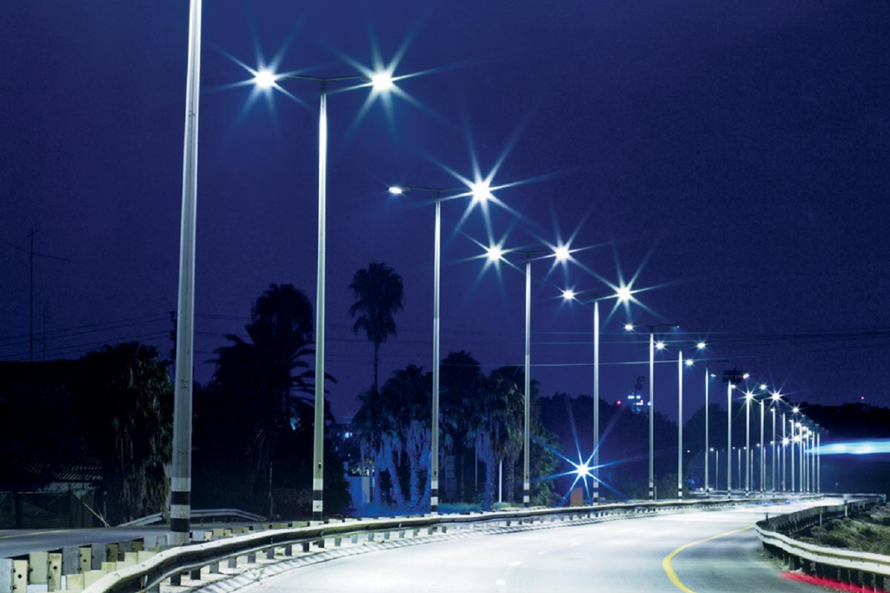

# 🌃 Automated Street Light Monitoring & Energy Saving System

<p align="center">
  
</p>

<div align="center">


**An intelligent IoT system that saves energy, detects faults, and keeps cities safer — all from the cloud.**

[📖 Documentation](#documentation) · [⚡ Quick Start](#quick-start) · [🔌 Hardware](#hardware-setup) · [☁️ Dashboard](#blynk-dashboard-setup) · [📊 Architecture](#system-architecture)

</div>

---

## 📌 Overview

This project implements a **fully autonomous street lighting system** powered by an ESP32 microcontroller. It uses a microwave radar sensor (RCWL-0516) and ambient light detection (LDR) to adaptively switch street lights **ON**, **DIM**, or **OFF** based on real-time conditions — all while monitoring electrical health and pushing telemetry to the **Blynk IoT cloud dashboard**.

The system is designed around three core principles:
- **Energy Efficiency** — Lights are never on unnecessarily
- **Safety** — Instant fault detection and cloud alerting
- **Intelligence** — Adaptive dimming based on occupancy and daylight

---

## ✨ Features

| Feature | Description |
|---|---|
| 🎯 **Motion-Adaptive Lighting** | RCWL-0516 radar detects motion; lights go full-bright within milliseconds |
| 🌞 **Daylight Override** | LDR-based ambient sensing keeps lights OFF during daytime |
| 🔆 **Smart Dimming** | Reduces brightness to ~24% when no motion is present at night |
| ⚡ **Electrical Monitoring** | ACS712 current sensor + resistor divider voltage sensing |
| 🚨 **Fault Detection** | Detects overcurrent, undervoltage, overvoltage, and lamp burnout |
| ☁️ **Cloud Dashboard** | Real-time Blynk dashboard with charts, gauges, and manual override |
| 🔁 **Auto Wi-Fi Reconnect** | Robust reconnection loop with exponential retry |
| 🕹️ **Manual Override** | Remote brightness control via Blynk virtual pins |
| 📈 **Energy Tracking** | Cumulative kWh accumulation reported to dashboard |

---

## 🏗️ System Architecture

```
┌─────────────────────────────────────────────────────────────────┐
│                     SENSOR LAYER                                │
│  ┌─────────────┐  ┌─────────────┐  ┌──────────┐  ┌──────────┐ │
│  │ RCWL-0516   │  │    LDR      │  │  ACS712  │  │ Voltage  │ │
│  │ Microwave   │  │  Ambient    │  │  Current │  │  Sensor  │ │
│  │   Radar     │  │   Light     │  │  Sensor  │  │ Divider  │ │
│  └──────┬──────┘  └──────┬──────┘  └────┬─────┘  └────┬─────┘ │
└─────────┼────────────────┼──────────────┼──────────────┼───────┘
          │                │              │              │
┌─────────▼────────────────▼──────────────▼──────────────▼───────┐
│                     ESP32 CONTROL UNIT                          │
│  ┌─────────────────────────────────────────────────────────┐   │
│  │  Control State Machine: OFF → DIM → ON → FAULT          │   │
│  │  - Sensor fusion & averaging                            │   │
│  │  - PWM brightness control (LEDC)                        │   │
│  │  - Fault detection logic                                │   │
│  │  - Energy accumulation (kWh)                            │   │
│  └─────────────────────────────────────────────────────────┘   │
└─────────────────────┬───────────────────────────────────────────┘
                      │ Wi-Fi (IEEE 802.11)
┌─────────────────────▼───────────────────────────────────────────┐
│                     BLYNK IoT CLOUD                             │
│  ┌────────────┐  ┌────────────┐  ┌──────────────┐              │
│  │  Gauges    │  │  Charts    │  │    Alerts    │              │
│  │ (V, I, P)  │  │ (History)  │  │ (Fault Log)  │              │
│  └────────────┘  └────────────┘  └──────────────┘              │
└─────────────────────────────────────────────────────────────────┘
          │
┌─────────▼───────────┐
│   OUTPUT LAYER      │
│  LED Street Light   │
│  (PWM + Relay)      │
└─────────────────────┘
```

---

## 🧩 Control Logic Flow

```
START
  │
  ▼
Is it DAYTIME? (LDR > threshold)
  │
  ├── YES ──▶ [ STATE: OFF ] — Light stays off, relay open
  │
  └── NO (nighttime)
        │
        ▼
     Fault condition active?
        │
        ├── YES ──▶ [ STATE: FAULT ] — Light off, send cloud alert
        │
        └── NO
              │
              ▼
           Motion detected? (within last 30s)
              │
              ├── YES ──▶ [ STATE: ON ] — Full brightness (PWM 255)
              │
              └── NO ───▶ [ STATE: DIM ] — Dim brightness (PWM 60)
```

---

## 🔌 Hardware Setup

### Components Required

| Component | Model | Qty | Purpose |
|---|---|---|---|
| Microcontroller | ESP32 Dev Board | 1 | Main controller |
| Motion Sensor | RCWL-0516 | 1 | Microwave radar motion detection |
| Light Sensor | LDR + 10kΩ resistor | 1 | Ambient daylight detection |
| Current Sensor | ACS712-5A | 1 | AC/DC current monitoring |
| Voltage Sensor | Resistor divider module | 1 | Supply voltage monitoring |
| Switch | Relay module (5V) | 1 | Mains load control |
| LED Driver | IRLZ44N MOSFET | 1 | PWM dimming control |
| Light | High-power LED (12V) | 1 | Simulated street lamp |
| Power Supply | 5V 2A USB / 12V adapter | 1 | System power |

### Wiring Summary

```
ESP32 GPIO23  ──────────── RCWL-0516 OUT
ESP32 GPIO34  ──── LDR ─── 3.3V (voltage divider with 10kΩ to GND)
ESP32 GPIO35  ──────────── ACS712 VOUT
ESP32 GPIO32  ──────────── Voltage Sensor OUT
ESP32 GPIO25  ──────────── MOSFET Gate (LED PWM)
ESP32 GPIO26  ──────────── Relay IN
ESP32 3.3V    ──────────── RCWL-0516 VCC, ACS712 VCC
ESP32 GND     ──────────── Common Ground
```

> See [`hardware/wiring_diagram.png`](hardware/wiring_diagram.png) for the full schematic and [`hardware/component_list.md`](hardware/component_list.md) for detailed part specifications.

---

## ⚡ Quick Start

### Prerequisites

- [Arduino IDE 2.x](https://www.arduino.cc/en/software) or PlatformIO
- ESP32 board package installed (`https://raw.githubusercontent.com/espressif/arduino-esp32/gh-pages/package_esp32_index.json`)
- [Blynk library](https://github.com/blynkkk/blynk-library) installed via Library Manager

### 1. Clone the Repository

```bash
git clone https://github.com/krss-94/Automated-Street-Light-Monitoring-And-Energy-Saving-System.git
cd Automated-Street-Light-Monitoring-And-Energy-Saving-System
```

### 2. Configure Credentials

Open `firmware/street_light_controller.ino` and replace the placeholders:

```cpp
#define BLYNK_TEMPLATE_ID   "TMPL_XXXXXXXXXX"    // From Blynk console
#define BLYNK_AUTH_TOKEN    "YOUR_AUTH_TOKEN"     // From Blynk console

const char* WIFI_SSID     = "YOUR_WIFI_SSID";
const char* WIFI_PASSWORD = "YOUR_WIFI_PASSWORD";
```

### 3. Calibrate Thresholds (Optional)

Adjust these constants for your environment:

```cpp
const int   LDR_NIGHT_THRESHOLD  = 1500;   // Tune for your LDR & location
const float CURRENT_MAX_A        = 5.0f;   // Match your lamp's rated current
const float VOLTAGE_MIN_V        = 180.0f; // Local grid specs
const float VOLTAGE_DIVIDER_RATIO = 5.0f;  // Match your hardware divider
```

### 4. Flash to ESP32

1. Select **ESP32 Dev Module** in Arduino IDE → Tools → Board
2. Set Upload Speed to `115200`
3. Click **Upload**
4. Open Serial Monitor at `115200` baud to verify operation

---

## ☁️ Blynk Dashboard Setup

### Virtual Pin Map

| Pin | Direction | Data | Widget |
|---|---|---|---|
| V0 | ESP32 reads | LED brightness (manual) | Slider |
| V1 | ESP32 writes | LDR ambient value | Gauge / Chart |
| V2 | ESP32 writes | Motion status (0/1) | LED indicator |
| V3 | ESP32 writes | Current (A) | Gauge |
| V4 | ESP32 writes | Voltage (V) | Gauge |
| V5 | ESP32 writes | Power (W) | SuperChart |
| V6 | ESP32 writes | System state (0-3) | Value Display |
| V7 | ESP32 reads | Manual override toggle | Switch |
| V8 | ESP32 reads | Manual brightness | Slider |
| V9 | ESP32 writes | Energy (kWh) | SuperChart |

### Recommended Widgets
- **Gauge** for V3, V4 — set min/max per specs
- **SuperChart** for V5, V9 — historical power and energy trends
- **LED Indicator** for V2 — green/red motion status
- **Switch** for V7 — manual override toggle
- **Slider** for V8 — manual brightness (0–255)
- **Event Log** — subscribe to `fault_alert` events

---

## 📊 Energy Savings Estimate

| Mode | Duty | Hours/Night | Savings vs Always-ON |
|---|---|---|---|
| Full Brightness (ON) | 100% | ~2 hrs | — |
| Dimmed (DIM) | 24% | ~6 hrs | ~76% |
| Off (Daytime) | 0% | ~12 hrs | 100% |

> **Estimated annual savings per light:** ~65% energy reduction compared to conventional always-on lighting.

---

## 🌍 SDG Alignment

| Goal | Relevance |
|---|---|
| **SDG 7** — Affordable & Clean Energy | Reduces energy waste in public infrastructure |
| **SDG 11** — Sustainable Cities | Enables smart city infrastructure |
| **SDG 13** — Climate Action | Lowers carbon footprint of urban lighting |

---

## 🔮 Future Enhancements

- [ ] GPS-tagged fault reporting for large-scale deployments
- [ ] LoRaWAN support for areas without Wi-Fi coverage
- [ ] ML-based adaptive threshold tuning from usage patterns
- [ ] Solar panel integration with battery state monitoring
- [ ] Multi-node mesh network for city-wide coordination
- [ ] OTA (Over-the-Air) firmware updates
- [ ] Edge AI pedestrian count and traffic density estimation

---

## 📚 Documentation

| Document | Description |
|---|---|
| [`docs/setup_guide.md`](docs/setup_guide.md) | Detailed installation and configuration guide |
| [`hardware/component_list.md`](hardware/component_list.md) | Full BOM with specs and sourcing |
| [`hardware/wiring_diagram.png`](hardware/wiring_diagram.png) | Circuit schematic |
| [`docs/Sprintathon_Report.pdf`](docs/Sprintathon_Report.pdf) | Project presentation report |

---

## 🛠️ Tech Stack

- **Firmware**: C/C++ · Arduino Core for ESP32
- **Cloud**: Blynk IoT Platform
- **Sensors**: RCWL-0516 · LDR · ACS712 · Voltage Divider
- **Protocols**: PWM (LEDC) · ADC · Digital I/O · Wi-Fi (802.11 b/g/n)

---

## 📄 License

This project is licensed under the **MIT License** — see [LICENSE](LICENSE) for details.

---

## 🤝 Contributing

Pull requests are welcome! For major changes, please open an issue first to discuss what you'd like to change.

---

<div align="center">

Made with ❤️ for smarter, greener cities

⭐ **Star this repo if it helped you!**

</div>
